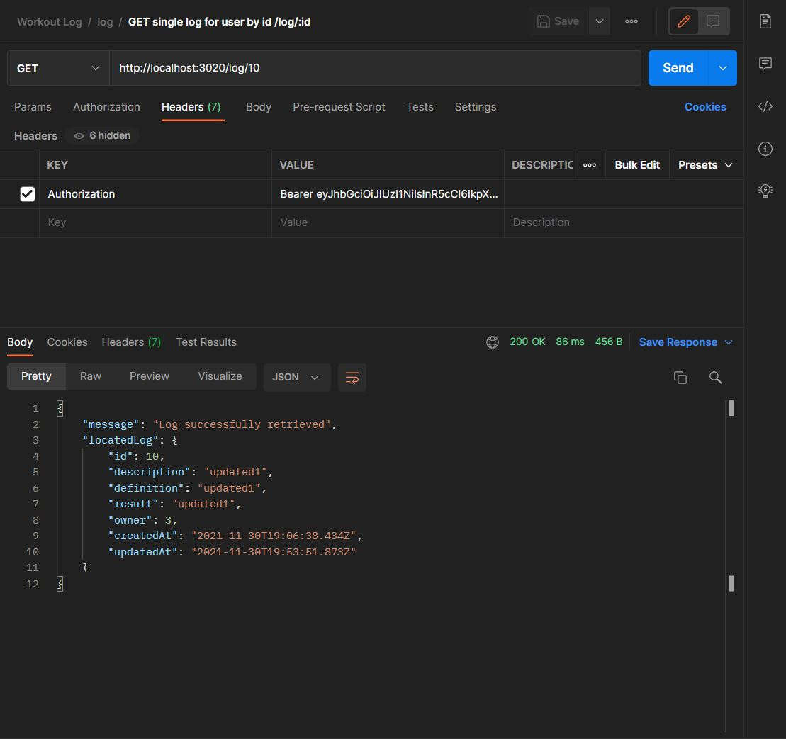
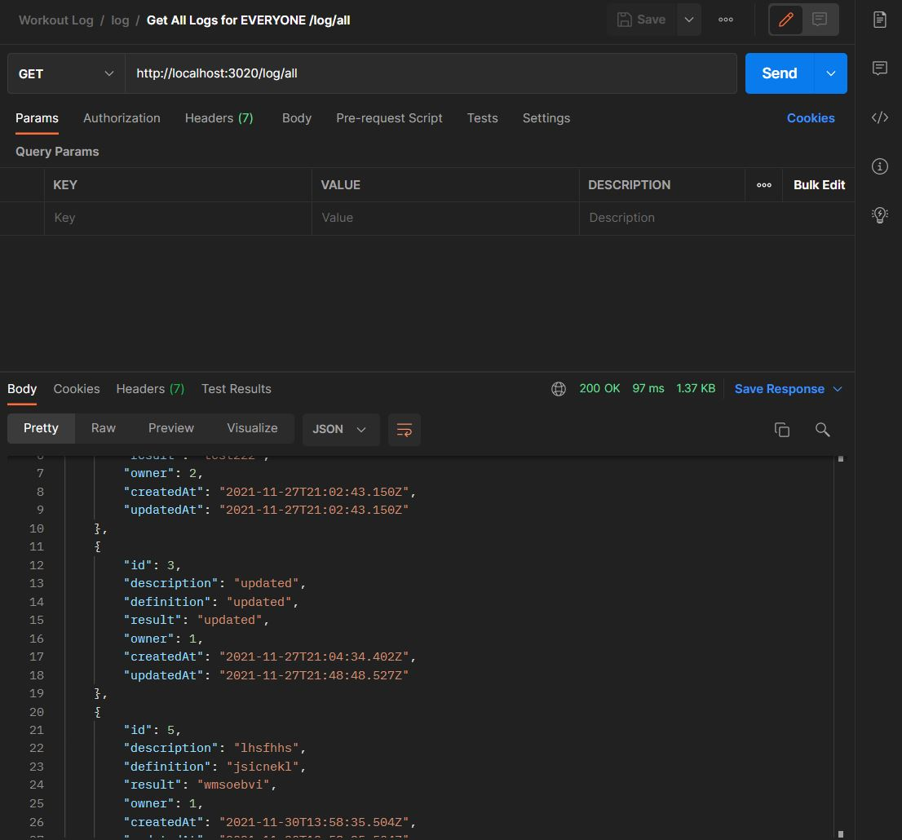

# WorkoutLog

#### POST | /user/register | Create user with username/login.

#### POST | /user/login | Log in with an existing user.

#### POST | /log/ | Create Log..

#### GET | /log/ | Gets all logs for user.

#### GET | /log/:id | Gets individual logs by id for user.

#### PUT | /log/:id | Update log by user.

#### DELETE | /log/:id | Delete user log by id.

#### GET | /log/all | Gets all logs. This one isn't needed, but it gave me a lot of issue, so I included it....
